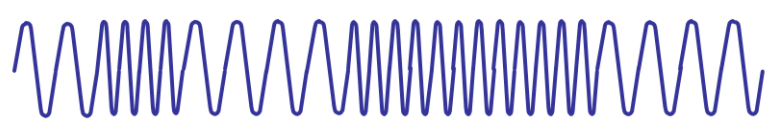

# 计算机基础的学习

[CSDN]: https://blog.csdn.net/weixin_44395686/article/details/105348105?spm=1001.2014.3001.5501	"计算机是如何运行的"

## 前言

在学习巩固计算机基础的时候突然想对之前的知识进行一个整理，大致的梳理了一下之前学习的知识内容包括，计算机网络，操作系统，开发语言，电路，计算机的组成等部分相关的知识的查询，阅读，理解，而后整理归纳本文。刚开始在学习<code>WebSocket</code>的时候，找了一个网上的小demo，简单学习了一下网络聊天室的基础逻辑。然后突然想具体的学习下双端的数据到底是如何通讯的。
本科时期的计算机网络知识只知道，在网络通讯时，A电脑通过操作要把信息发送到B电脑，A会将信息以数据包的形式发送到B。可是，B计算机是如何接收的？A计算机是如何处理的？这让我产生了很大的疑问。理解上我可以将数据理解为数据包。可是，两台计算机时间是根据光纤进行连接的。光纤内的东西又不是包，只是光。

## 1，计算机的起源与发展

首先，计算机的运行依赖于电，电流对于计算机就像是血液相对于人。计算机的基本原理就是通过电流的有无，变为数字化的0，1。二进制就这样出现了，早期的人们通过简单的二进制制造了加法机。而后，电生磁的出现让人们发现了波的存在。电子二极管的出现促进了现代计算机的诞生。这里不做过多的赘述。

## 2，cpu

cpu是利用了现代的光刻技术，替换了早期的二极管。在极微小的空间下，放入了大量的逻辑门。

## 3，知识储备

我现在想到的要具有高中的基本物理知识，本科的操作系统，计算机网络，编程语言。这些基本就够了。

## 4，开始

首先，我们在计算机上面的操作会被记录在磁盘或者内存上。每一次真正的保存，其实就将数据保存在了磁盘的某个地方。在操作系统的知识基础中，每一个地方其实就是数据存放的一处地址，根据不同的算法，数据的存取方式也不一样。
但是，磁盘具体是如何进行物理存储的我还没有去查找。按照我现在的理解就是，类似音乐中的胶片，过去vcd，dvd中的碟片，放大后会编程不同的波纹，计算机会根据波纹的内容来进行存取。波，就用到了高中时期的物理知识。

;
    
计算机就是先通过cpu将相关的指令转换成不同的电波，然后再通过特定的处理转换成光波，光波在光纤中传递，然后某个特定的计算机通过地址解析，获取需要的波。光波->电波->电信号->电波->光波这样的流程。
计算机将获取到的波信号转为数字信号，01的形式也就是常说的比特流。上图就可以理解为波峰是1波谷是0.自此，数据的传递应该就有了一个梗概。接下来就是计算机网络的基础知识，学计算机网络最大的印象就是OSI七层协议，TCP/IP协议。通过物理的方式将两台计算机连接起来，在OSI中就是物理层，TCP/IP协议中就是网络接口层。
自此，计算机之间的数据传输逻辑就基本明白了。两台计算机之间是如何通过地址访问的，这个也是计算机网络中的知识。整个的知识体系结构，还有很多能够延申和补充的地方，现在我只把自己想要梳理的内容整理到文档中。

## 5，延申

接下来就是操作系统中的内容，这部分是我在学习设计模式，数据结构与算法，多线程内容的时候开始陆续产生并思考的问题。
在单例模式(确保一个类只有一个实例，并提供该实例的全局访问点)中，通过加锁的方式来让对象在实例化的过程中保证线程安全，重量级锁<code>synchronized</code>和轻量级锁<code>volatile</code>的出现，让我开始重新回顾了一点操作系统的知识。

