#   java部分
##  了解
    1,jvm,jre,jdk的区别。
        1，jvm：java virtual machine  (java虚拟机，运行java代码)
        2,jre: java runing environment(java运行环境)
        3,jdk : java development kid (java开发包,包含了jre，jvm)
##  基础
    1，标识符和关键字
        常见的有: class public private int void 等
    2，注释
        1，// 2，/**/ 3,/****/
    3,doc注释
        @author,@version,@param
    4,常量
        int a=10.等
    5，静态变量，全局变量，局部变量
        1,静态变量：用static修饰,是被放到静态池中的。其地址在运行期间一直不会改变.
        2,用public修饰的static变量。
        3,形参，方法内，代码块内。
        小知识：成员变量存在于堆内存中和类一起创建。局部变量存在于栈内存中，当方法执行完成，让出内存让其他方法使用.
    6,数据类型
        一个字节=8位
        8个。byte（1）,int（4）,long(8),double(8),char(2),boolean(1),float(4),short(2)。
    7,数据类型转换
        要求：1，两种数据兼容2，目标数据取值范围大于原数据（低类型转高类型）
        隐式转换
        byte->short->int->long->float->double
        char->int
        显示转换（强转）
        (类型)
    8,位运算符(~非,&与,|或,^异或)除了~是单目运算符，其他都是双目。
        规则：
            1，位与运算符为&，其运算规则是：参与运算的数字，低位对齐，高位不足的补零，如果对应的二进制位同时为 1，那么计算结果才为 1，否则为 0。因此，任何数与 0 进行按位与运算，其结果都为 0。
            2，位或运算符为|，其运算规则是：参与运算的数字，低位对齐，高位不足的补零。如果对应的二进制位只要有一个为 1，那么结果就为 1；如果对应的二进制位都为 0，结果才为 0。
            3，位异或运算符为^，其运算规则是：参与运算的数字，低位对齐，高位不足的补零，如果对应的二进制位相同（同时为 0 或同时为 1）时，结果为 0；如果对应的二进制位不相同，结果则为 1。
            4，位取反运算符为~，其运算规则是：只对一个操作数进行运算，将操作数二进制中的 1 改为 0，0 改为 1。
    9，位移运算符(>>,<<)
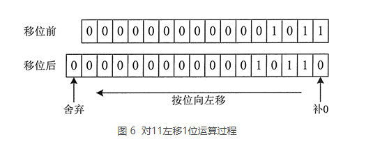<br>
    
    10,复合位赋值运算符
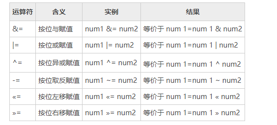
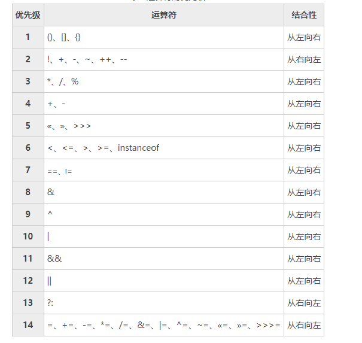

    instanceof(测试左边的对象是否是右边类或者该类的子类创建的实例对象，是，则返回true，否则返回false。)

## 字符串
    1，定义方式
        1，直接定义。2，构造函数
    2，去除字符串中的空格。
        trim()方法
    3,提取子字符串
        subString(int from);
        subString(int from,int end)
    4,分割
        split();
    5,替换
        replace();
        replaceAll();
    6,比较
        equal():
            比较的是字符串中的字符。
        ==:
            比较的是两个对象的引用（地址）
        equalsIgnoreCase() 比较时不区分大小写
        compareTo();
    7，查找
        indexof()
        charAt()
### StringBuffer类
    1，可变的字符串类.
    2，拼接
        append();
    3,替换
        setCharAt();
    4,反转
        reverse();
    5,删除
        deleteCharAt();
        delete();
## String,StringBuffer,StringBuilder的区别
    1,String类是不可变类，一旦一个String对象被创建后在这个对象中的字符序列是不可变的。
    2,StringBuffer和StringBuilder的功能基本相同。但是，StringBuffer是线程安全的，StringBuilder是非线程安全的。
## 正则表达式
    1,在代码中常简写为 regex、regexp 或 RE，它是计算机科学的一个概念。
    2，String 类里也提供了如下几个特殊的方法。
        boolean matches(String regex)：判断该字符串是否匹配指定的正则表达式。
        String replaceAll(String regex, String replacement)：将该字符串中所有匹配 regex 的子串替换成 replacement。
        String replaceFirst(String regex, String replacement)：将该字符串中第一个匹配 regex 的子串替换成 replacement。
        String[] split(String regex)：以 regex 作为分隔符，把该字符串分割成多个子串。
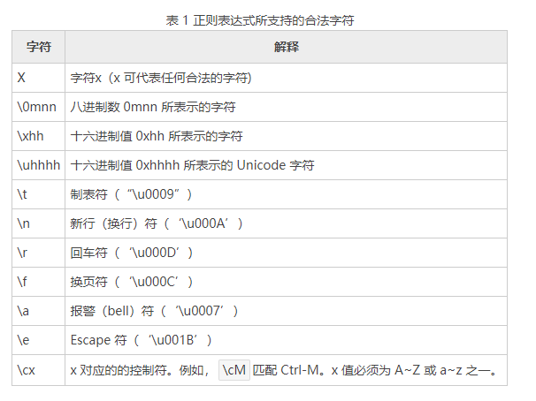
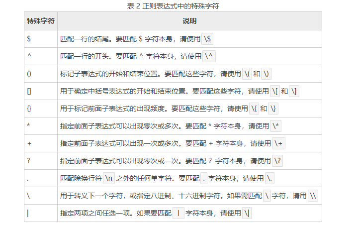
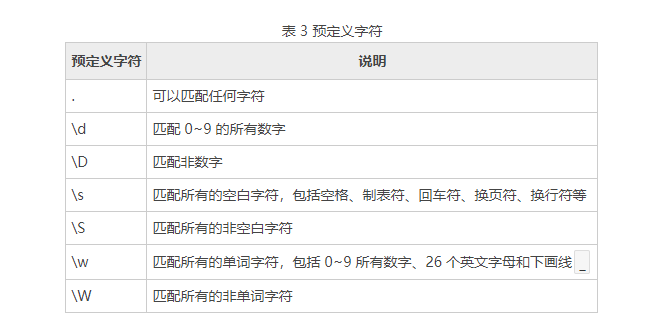

    d 是 digit 的意思，代表数字。
    s 是 space 的意思，代表空白。
    w 是 word 的意思，代表单词。
    d、s、w 的大写形式恰好匹配与之相反的字符。
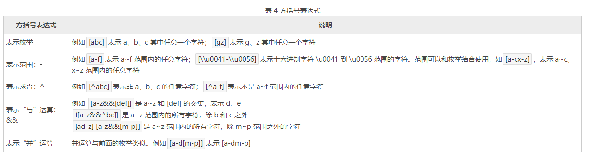
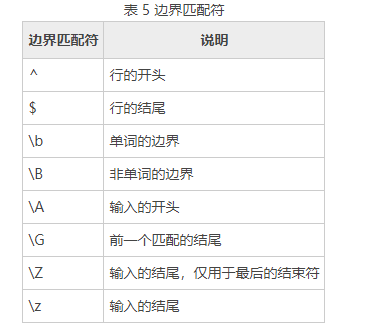

    Greedy（贪婪模式）：数量表示符默认采用贪婪模式，除非另有表示。贪婪模式的表达式会一直匹配下去，直到无法匹配为止。如果你发现表达式匹配的结果与预期的不符，很有可能是因为你以为表达式只会匹配前面几个字符，而实际上它是贪婪模式，所以会一直匹配下去。
    Reluctant（勉强模式）：用问号后缀（?）表示，它只会匹配最少的字符。也称为最小匹配模式。
    Possessive（占有模式）：用加号后缀（+）表示，目前只有 Java 支持占有模式，通常比较少用。
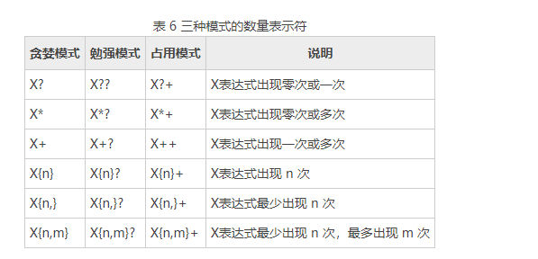

    3,正则匹配手机号
        String str=""1[3-9][0-9]\\d{8};
##  数字与日期
    1，math类
        提供了常见的数学方法，圆周率pi，常量E
    2，随机数
        Random 类提供了丰富的随机数生成方法，可以产生 boolean、int、long、float、byte 数组以及 double 类型的随机数，这是它与 random() 方法最大的不同之处。random() 方法只能产生 double 类型的 0~1 的随机数。
    3,数字格式化
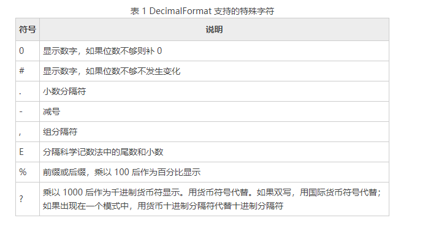

    4,大数运算
        BigInteger 类是针对整型大数字的处理类，而 BigDecimal 类是针对大小数的处理类。
    5,日期与时间
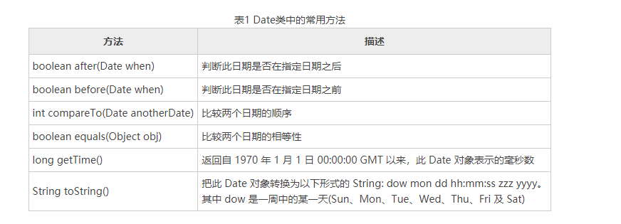

        1,Calendar 类是一个抽象类，它为特定瞬间与 YEAR、MONTH、DAY_OF—MONTH、HOUR 等日历字段之间的转换提供了一些方法，并为操作日历字段（如获得下星期的日期） 提供了一些方法。
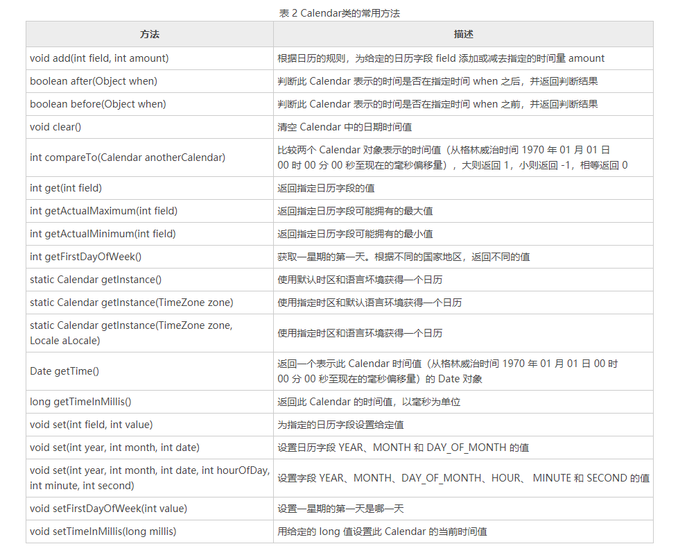
    
        2,DateFormat 是日期/时间格式化子类的抽象类，它以与语言无关的方式格式化并解析日期或时间。日期/时间格式化子类（如 SimpleDateFormat）允许进行格式化（也就是日期→文本）、解析（文本→日期）和标准化日期。
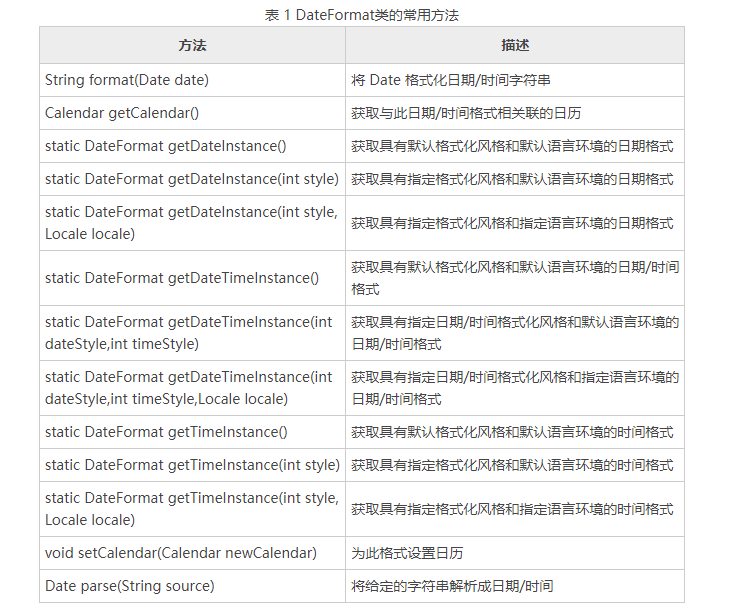

            SHORT：完全为数字，如 12.5.10 或 5:30pm。
            MEDIUM：较长，如 May 10，2016。
            LONG：更长，如 May 12，2016 或 11:15:32am。
            FULL：是完全指定，如 Tuesday、May 10、2012 AD 或 11:l5:42am CST。
        3,如果使用 DateFormat 类格式化日期/时间并不能满足要求，那么就需要使用 DateFormat 类的子类——SimpleDateFormat。
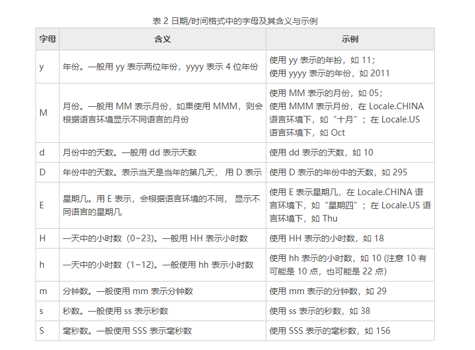

##  Java包装类、装箱和拆箱
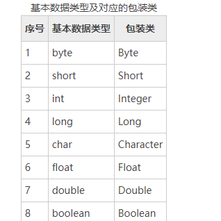
    
    1，Object类
        所有类都继承的类包含了基本方法。
##  数组
    1,Arrays工具类
        1）int binarySearch(type[] a, type key)
            使用二分法查询 key 元素值在 a 数组中出现的索引，如果 a 数组不包含 key 元素值，则返回负数。调用该方法时要求数组中元素己经按升序排列，这样才能得到正确结果。
        2）int binarySearch(type[] a, int fromIndex, int toIndex, type key)
            这个方法与前一个方法类似，但它只搜索 a 数组中 fromIndex 到 toIndex 索引的元素。调用该方法时要求数组中元素己经按升序排列，这样才能得到正确结果。
        3）type[] copyOf(type[] original, int length)
            这个方法将会把 original 数组复制成一个新数组，其中 length 是新数组的长度。如果 length 小于 original 数组的长度，则新数组就是原数组的前面 length 个元素，如果 length 大于 original 数组的长度，则新数组的前面元索就是原数组的所有元素，后面补充 0（数值类型）、false（布尔类型）或者 null（引用类型）。
        4）type[] copyOfRange(type[] original, int from, int to)
            这个方法与前面方法相似，但这个方法只复制 original 数组的 from 索引到 to 索引的元素。
        5）boolean equals(type[] a, type[] a2)
            如果 a 数组和 a2 数组的长度相等，而且 a 数组和 a2 数组的数组元素也一一相同，该方法将返回 true。
        6）void fill(type[] a, type val)
            该方法将会把 a 数组的所有元素都赋值为 val。
        7）void fill(type[] a, int fromIndex, int toIndex, type val)
            该方法与前一个方法的作用相同，区别只是该方法仅仅将 a 数组的 fromIndex 到 toIndex 索引的数组元素赋值为 val。
        8）void sort(type[] a)
            该方法对 a 数组的数组元素进行排序。
        9）void sort(type[] a, int fromIndex, int toIndex)
            该方法与前一个方法相似，区别是该方法仅仅对 fromIndex 到 toIndex 索引的元素进行排序。
        10）String toString(type[] a)
            该方法将一个数组转换成一个字符串。该方法按顺序把多个数组元素连缀在一起，多个数组元素使用英文逗号,和空格隔开。
<p style="color: red">2,排序。（这部分在数据结构中搞）</p>

##  类和对象
    1,定义
        public：表示“共有”的意思。如果使用 public 修饰，则可以被其他类和程序访问。每个 Java 程序的主类都必须是 public 类，作为公共工具供其他类和程序使用的类应定义为 public 类。
        abstract：如果类被 abstract 修饰，则该类为抽象类，抽象类不能被实例化，但抽象类中可以有抽象方法（使用 abstract 修饰的方法）和具体方法（没有使用 abstract 修饰的方法）。继承该抽象类的所有子类都必须实现该抽象类中的所有抽象方法（除非子类也是抽象类）。
        final：如果类被 final 修饰，则不允许被继承。
        class：声明类的关键字。
        class_name：类的名称。
        extends：表示继承其他类。
        implements：表示实现某些接口。
        property_type：表示成员变量的类型。
        property：表示成员变量名称。
        function()：表示成员方法名称
    2,this关键字
        this 关键字是 Java 常用的关键字，可用于任何实例方法内指向当前对象，也可指向对其调用当前方法的对象，或者在需要当前类型对象引用时使用。
    3,访问控制修饰符
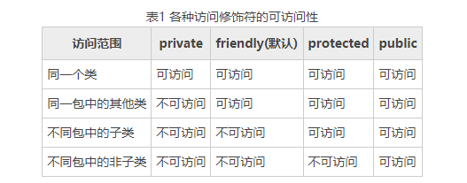
    
    4,static
        使用 static 修饰符修饰的属性（成员变量）称为静态变量，也可以称为类变量，常量称为静态常量，方法称为静态方法或类方法，它们统称为静态成员，归整个类所有。
        static 修饰的成员变量和方法，从属于类。
        普通变量和方法从属于对象。
        静态方法不能调用非静态成员，编译会报错。
        类的成员变量可以分为以下两种：
            静态变量（或称为类变量），指被 static 修饰的成员变量。
            实例变量，指没有被 static 修饰的成员变量。
        静态变量与实例变量的区别如下：
        1）静态变量
            运行时，Java 虚拟机只为静态变量分配一次内存，在加载类的过程中完成静态变量的内存分配。
            在类的内部，可以在任何方法内直接访问静态变量。
            在其他类中，可以通过类名访问该类中的静态变量。
        2）实例变量
            每创建一个实例，Java 虚拟机就会为实例变量分配一次内存。
            在类的内部，可以在非静态方法中直接访问实例变量。
            在本类的静态方法或其他类中则需要通过类的实例对象进行访问。
        与成员变量类似，成员方法也可以分为以下两种：
            静态方法（或称为类方法），指被 static 修饰的成员方法。
            实例方法，指没有被 static 修饰的成员方法。
        
        静态方法与实例方法的区别如下：
            静态方法不需要通过它所属的类的任何实例就可以被调用，因此在静态方法中不能使用 this 关键字，也不能直接访问所属类的实例变量和实例方法，但是可以直接访问所属类的静态变量和静态方法。另外，和 this 关键字一样，super 关键字也与类的特定实例相关，所以在静态方法中也不能使用 super 关键字。
            在实例方法中可以直接访问所属类的静态变量、静态方法、实例变量和实例方法。
    5,final
        final 在 Java 中的意思是最终，也可以称为完结器，表示对象是最终形态的，不可改变的意思。final 应用于类、方法和变量时意义是不同的，但本质是一样的，都表示不可改变，类似 C# 里的 sealed 关键字。
        使用 final 关键字声明类、变量和方法需要注意以下几点：
            final 用在变量的前面表示变量的值不可以改变，此时该变量可以被称为常量。
            final 用在方法的前面表示方法不可以被重写（子类中如果创建了一个与父类中相同名称、相同返回值类型、相同参数列表的方法，只是方法体中的实现不同，以实现不同于父类的功能，这种方式被称为方法重写，又称为方法覆盖。这里了解即可，教程后面我们会详细讲解）。
            final 用在类的前面表示该类不能有子类，即该类不可以被继承。
    6,构造
        构造方法是类的一种特殊方法，用来初始化类的一个新的对象，在创建对象（new 运算符）之后自动调用。Java 中的每个类都有一个默认的构造方法，并且可以有一个以上的构造方法。
        Java 构造方法有以下特点：
            方法名必须与类名相同
            可以有 0 个、1 个或多个参数
            没有任何返回值，包括 void
            默认返回类型就是对象类型本身
            只能与 new 运算符结合使用
<p style="color: red">递归在数据结构中研究</p>

## 继承与多态
    1，类的封装
        面向对象的三大特性之一。封装将类的某些信息隐藏在类内部，不允许外部程序直接访问，只能通过该类提供的方法来实现对隐藏信息的操作和访问。
    2，继承
        之面向对象的三大特性一。继承就是在已经存在类的基础上进行扩展，从而产生新的类。已经存在的类称为父类、基类或超类，而新产生的类称为子类或派生类。在子类中，不仅包含父类的属性和方法，还可以增加新的属性和方法。
        Java 不支持多继承，只允许一个类直接继承另一个类，即子类只能有一个直接父类，extends 关键字后面只能有一个类名。
        继承的优缺点
            在面向对象语言中，继承是必不可少的、非常优秀的语言机制，它有如下优点：
            实现代码共享，减少创建类的工作量，使子类可以拥有父类的方法和属性。
            提高代码维护性和可重用性。
            提高代码的可扩展性，更好的实现父类的方法。
        继承的缺点如下：
            继承是侵入性的。只要继承，就必须拥有父类的属性和方法。
            降低代码灵活性。子类拥有父类的属性和方法后多了些约束。
            增强代码耦合性（开发项目的原则为高内聚低耦合）。当父类的常量、变量和方法被修改时，需要考虑子类的修改，有可能会导致大段的代码需要重构。
    3，super
        子类不能继承父类的构造方法，因此，如果要调用父类的构造方法，可以使用 super 关键字。super 可以用来访问父类的构造方法、普通方法和属性。
        super 关键字的功能：
            在子类的构造方法中显式的调用父类构造方法
            访问父类的成员方法和变量。
        如果一个类中没有写任何的构造方法，JVM 会生成一个默认的无参构造方法。在继承关系中，由于在子类的构造方法中，第一条语句默认为调用父类的无参构造方法（即默认为 super()，一般这行代码省略了）。所以当在父类中定义了有参构造方法，但是没有定义无参构造方法时，编译器会强制要求我们定义一个相同参数类型的构造方法。
    4,对象类型转换
        将一个类型强制转换成另一个类型的过程被称为类型转换。本节所说的对象类型转换，是指存在继承关系的对象，不是任意类型的对象。当对不存在继承关系的对象进行强制类型转换时，会抛出 Java 强制类型转换（java.lang.ClassCastException）异常。
        Java 语言允许某个类型的引用变量引用子类的实例，而且可以对这个引用变量进行类型转换。Java 中引用类型之间的类型转换（前提是两个类是父子关系）主要有两种，分别是向上转型（upcasting）和向下转型（downcasting）。
        1）向上转型
            父类引用指向子类对象为向上转型
        2）向下转型
            与向上转型相反，子类对象指向父类引用为向下转型
    5,重载
        如果同一个类中包含了两个或两个以上方法名相同的方法，但形参列表不同，这种情况被称为方法重载（overload）;
    6,重写
        在子类中如果创建了一个与父类中相同名称、相同返回值类型、相同参数列表的方法，只是方法体中的实现不同，以实现不同于父类的功能，这种方式被称为方法重写（override），又称为方法覆盖。当父类中的方法无法满足子类需求或子类具有特有功能的时候，需要方法重写。
        在重写方法时，需要遵循下面的规则：
            参数列表必须完全与被重写的方法参数列表相同。
            返回的类型必须与被重写的方法的返回类型相同（Java1.5 版本之前返回值类型必须一样，之后的 Java 版本放宽了限制，返回值类型必须小于或者等于父类方法的返回值类型）。
            访问权限不能比父类中被重写方法的访问权限更低（public>protected>default>private）。
            重写方法一定不能抛出新的检査异常或者比被重写方法声明更加宽泛的检査型异常。例如，父类的一个方法声明了一个检査异常 IOException，在重写这个方法时就不能抛出 Exception，只能拋出 IOException 的子类异常，可以抛出非检査异常。
            重写的方法可以使用 @Override 注解来标识。
            父类的成员方法只能被它的子类重写。
            声明为 final 的方法不能被重写。
            声明为 static 的方法不能被重写，但是能够再次声明。
            构造方法不能被重写。
            子类和父类在同一个包中时，子类可以重写父类的所有方法，除了声明为 private 和 final 的方法。
            子类和父类不在同一个包中时，子类只能重写父类的声明为 public 和 protected 的非 final 方法。
            如果不能继承一个方法，则不能重写这个方法。
    7,多态
        之面向对象的三大特性一。
        多态性是面向对象编程的又一个重要特征，它是指在父类中定义的属性和方法被子类继承之后，可以具有不同的数据类型或表现出不同的行为，这使得同一个属性或方法在父类及其各个子类中具有不同的含义。
        对面向对象来说，多态分为编译时多态和运行时多态。其中编译时多态是静态的，主要是指方法的重载，它是根据参数列表的不同来区分不同的方法。通过编译之后会变成两个不同的方法，在运行时谈不上多态。而运行时多态是动态的，它是通过动态绑定来实现的，也就是大家通常所说的多态性。
        Java 实现多态有 3 个必要条件：继承、重写和向上转型。只有满足这 3 个条件，开发人员才能够在同一个继承结构中使用统一的逻辑实现代码处理不同的对象，从而执行不同的行为。
        继承：在多态中必须存在有继承关系的子类和父类。
        重写：子类对父类中某些方法进行重新定义，在调用这些方法时就会调用子类的方法。
        向上转型：在多态中需要将子类的引用赋给父类对象，只有这样该引用才既能可以调用父类的方法，又能调用子类的方法。
    8，抽象类
        用abstract修饰的类。
        如果一个方法使用 abstract 来修饰，则说明该方法是抽象方法，抽象方法只有声明没有实现。需要注意的是 abstract 关键字只能用于普通方法，不能用于 static 方法或者构造方法中。
        抽象方法的 3 个特征如下：
            抽象方法没有方法体
            抽象方法必须存在于抽象类中
            子类重写父类时，必须重写父类所有的抽象方法
        注意：在使用 abstract 关键字修饰抽象方法时不能使用 private 修饰，因为抽象方法必须被子类重写，而如果使用了 private 声明，则子类是无法重写的。
        抽象类的定义和使用规则如下：
            抽象类和抽象方法都要使用 abstract 关键字声明。
            如果一个方法被声明为抽象的，那么这个类也必须声明为抽象的。而一个抽象类中，可以有 0~n 个抽象方法，以及 0~n 个具体方法。
            抽象类不能实例化，也就是不能使用 new 关键字创建对象。
    9，接口
        用interface修饰的类。
    10，java8特性——lambda表达式
        Lambda 表达式（Lambda expression）是一个匿名函数，基于数学中的λ演算得名，也可称为闭包（Closure）。把函数作为一个方法的参数（函数作为参数传递进方法中）
##  异常
    1,在 Java 中一个异常的产生，主要有如下三种原因：
        Java 内部错误发生异常，Java 虚拟机产生的异常。
        编写的程序代码中的错误所产生的异常，例如空指针异常、数组越界异常等。
        通过 throw 语句手动生成的异常，一般用来告知该方法的调用者一些必要信息。
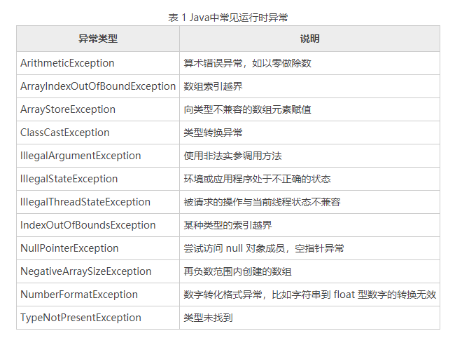
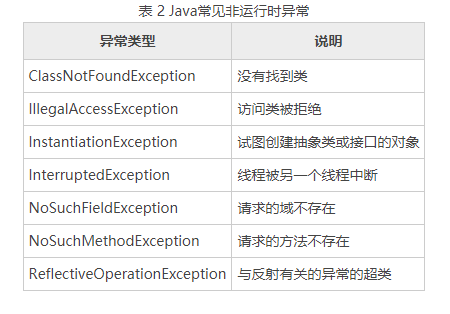
    
    2,Error和Exception的异同
        Exception 是程序正常运行过程中可以预料到的意外情况，并且应该被开发者捕获，进行相应的处理。Error 是指正常情况下不大可能出现的情况，绝大部分的 Error 都会导致程序处于非正常、不可恢复状态。所以不需要被开发者捕获。
        常见的 Error 和 Exception：
            1）运行时异常（RuntimeException）：
            NullPropagation：空指针异常；
            ClassCastException：类型强制转换异常
            IllegalArgumentException：传递非法参数异常
            IndexOutOfBoundsException：下标越界异常
            NumberFormatException：数字格式异常
            
            2）非运行时异常：
            ClassNotFoundException：找不到指定 class 的异常
            IOException：IO 操作异常
            
            3）错误（Error）：
            NoClassDefFoundError：找不到 class 定义异常
            StackOverflowError：深递归导致栈被耗尽而抛出的异常
            OutOfMemoryError：内存溢出异常
    3,异常处理机制
        异常处理通过 5 个关键字来实现：try、catch、throw、throws 和 finally。try catch 语句用于捕获并处理异常，finally 语句用于在任何情况下（除特殊情况外）都必须执行的代码，throw 语句用于拋出异常，throws 语句用于声明可能会出现的异常。
```java
    public  class demo{
        public static void main(String[] args) {
            try {
                //逻辑程序块
            } catch(ExceptionType1 e) {
                //处理代码块1
            } catch (ExceptionType2 e) {
                //处理代码块2
                throw(e);    // 再抛出这个"异常"
            } finally {
               // 释放资源代码块
            }
        }
        
    }
```
    如果 try 语句块中发生异常，那么一个相应的异常对象就会被拋出，然后 catch 语句就会依据所拋出异常对象的类型进行捕获，并处理。处理之后，程序会跳过 try 语句块中剩余的语句，转到 catch 语句块后面的第一条语句开始执行。
    4,语句
        使用 try-catch-finally 语句时需注意以下几点：
            异常处理语法结构中只有 try 块是必需的，也就是说，如果没有 try 块，则不能有后面的 catch 块和 finally 块；
            catch 块和 finally 块都是可选的，但 catch 块和 finally 块至少出现其中之一，也可以同时出现；
            可以有多个 catch 块，捕获父类异常的 catch 块必须位于捕获子类异常的后面；
            不能只有 try 块，既没有 catch 块，也没有 finally 块；
            多个 catch 块必须位于 try 块之后，finally 块必须位于所有的 catch 块之后。
            finally 与 try 语句块匹配的语法格式，此种情况会导致异常丢失，所以不常见。
        try catch finally 语句块的执行情况可以细分为以下 3 种情况：
            如果 try 代码块中没有拋出异常，则执行完 try 代码块之后直接执行 finally 代码块，然后执行 try catch finally 语句块之后的语句。
            如果 try 代码块中拋出异常，并被 catch 子句捕捉，那么在拋出异常的地方终止 try 代码块的执行，转而执行相匹配的 catch 代码块，之后执行 finally 代码块。如果 finally 代码块中没有拋出异常，则继续执行 try catch finally 语句块之后的语句；如果 finally 代码块中拋出异常，则把该异常传递给该方法的调用者。
            如果 try 代码块中拋出的异常没有被任何 catch 子句捕捉到，那么将直接执行 finally 代码块中的语句，并把该异常传递给该方法的调用者。
    5,throws声明异常
        使用 throws 声明抛出异常时有一个限制，是方法重写中的一条规则：子类方法声明抛出的异常类型应该是父类方法声明抛出的异常类型的子类或相同，子类方法声明抛出的异常不允许比父类方法声明抛出的异常多。
    6,throw 抛出异常
        与 throws 不同的是，throw 语句用来直接拋出一个异常，后接一个可拋出的异常类对象
## 集合，泛型和枚举
    1,集合
        集合类主要负责保存、盛装其他数据，因此集合类也被称为容器类。
        Java 集合类型分为 Collection 和 Map，它们是 Java 集合的根接口，这两个接口又包含了一些子接口或实现类。
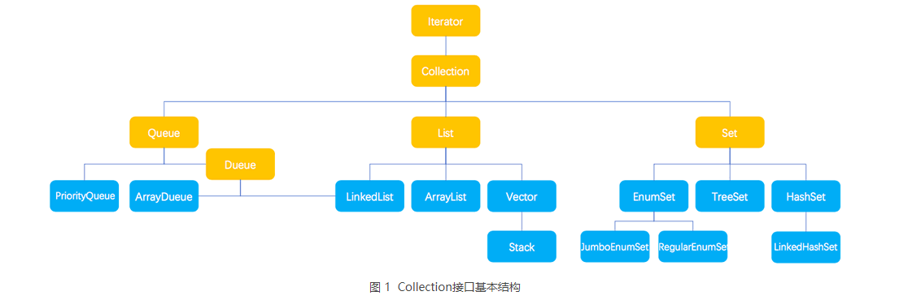
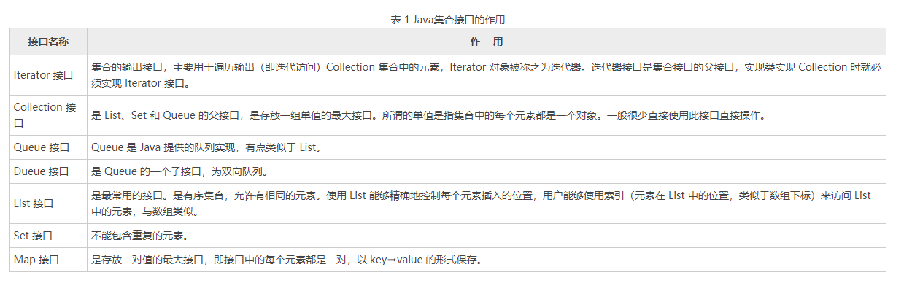
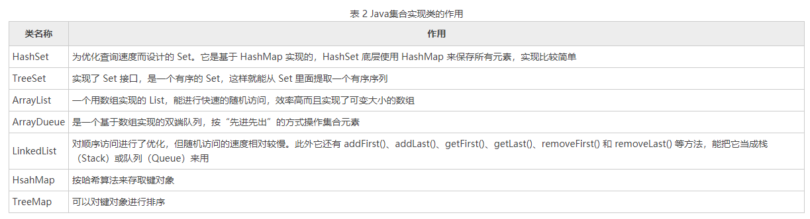


    2,collection
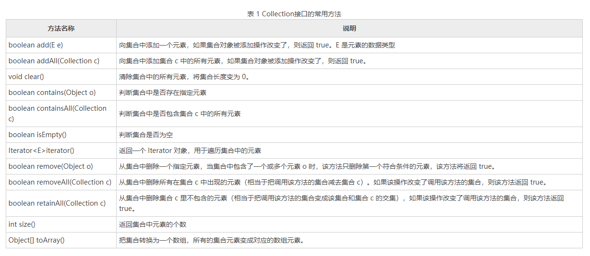
    
    3,List
        List 是一个有序、可重复的集合，集合中每个元素都有其对应的顺序索引。List 集合允许使用重复元素，可以通过索引来访问指定位置的集合元素。List 集合默认按元素的添加顺序设置元素的索引，第一个添加到 List 集合中的元素的索引为 0，第二个为 1，依此类推。
        List 实现了 Collection 接口，它主要有两个常用的实现类：ArrayList 类和 LinkedList 类。
        ArrayList类实现了可变数组的大小，存储在内的数据称为元素。它还提供了快速基于索引访问元素的方式，对尾部成员的增加和删除支持较好。使用 ArrayList 创建的集合，允许对集合中的元素进行快速的随机访问，不过，向 ArrayList 中插入与删除元素的速度相对较慢。
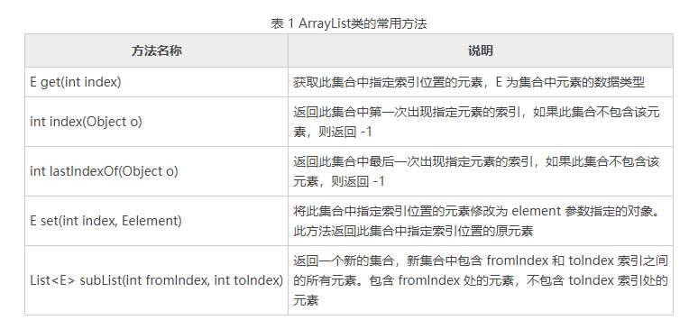

        当调用 List 的 set(int index, Object element) 方法来改变 List 集合指定索引处的元素时，指定的索引必须是 List 集合的有效索引。例如集合长度为 4，就不能指定替换索引为 4 处的元素，也就是说这个方法不会改变 List 集合的长度。
    4,set
        Set 集合类似于一个罐子，程序可以依次把多个对象“丢进”Set 集合，而 Set 集合通常不能记住元素的添加顺序。也就是说 Set 集合中的对象不按特定的方式排序，只是简单地把对象加入集合。Set 集合中不能包含重复的对象，并且最多只允许包含一个 null 元素。
        Set 实现了 Collection 接口，它主要有两个常用的实现类：HashSet 类和 TreeSet类。
        hashset
            HashSet 是 Set 接口的典型实现，大多数时候使用 Set 集合时就是使用这个实现类。HashSet 是按照 Hash 算法来存储集合中的元素。因此具有很好的存取和查找性能。
            HashSet 具有以下特点：
                不能保证元素的排列顺序，顺序可能与添加顺序不同，顺序也有可能发生变化。
                HashSet 不是同步的，如果多个线程同时访问或修改一个 HashSet，则必须通过代码来保证其同步。
                集合元素值可以是 null。
        treeset
        TreeSet 类同时实现了 Set 接口和 SortedSet 接口。SortedSet 接口是 Set 接口的子接口，可以实现对集合进行自然排序，因此使用 TreeSet 类实现的 Set 接口默认情况下是自然排序的，这里的自然排序指的是升序排序。
        TreeSet 只能对实现了 Comparable 接口的类对象进行排序，因为 Comparable 接口中有一个 compareTo(Object o) 方法用于比较两个对象的大小。例如 a.compareTo(b)，如果 a 和 b 相等，则该方法返回 0；如果 a 大于 b，则该方法返回大于 0 的值；如果 a 小于 b，则该方法返回小于 0 的值。
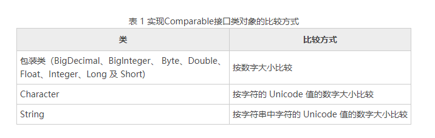
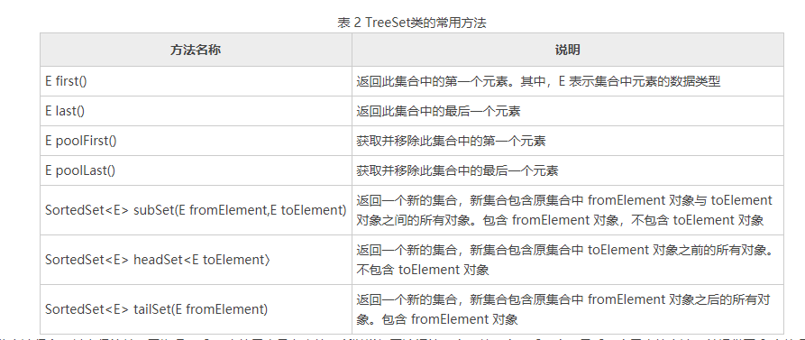
    
        